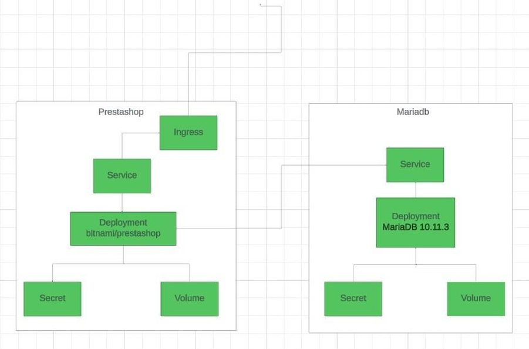

# Prestashop_K3S

the goal of this project is to deploy a prestashop docker image 
with a mariadb database using kubernetes.

## our deployment structure



## to go further

create a kubernetes cluster for our deployment with 
03 nodes including a master and 02 workers 

K3s official documentation link:
``` text 
https://docs.k3s.io/quick-start
```
To install K3s, we can just run:
```
curl -sfL https://get.k3s.io | sh -
```
A single-node server installation is a fully-functional 
Kubernetes cluster

To install additional agent nodes and add them to 
the cluster, we can  run the installation script with the 
K3S_URL and K3S_TOKEN
```
curl -sfL https://get.k3s.io | K3S_URL=https://myserver:6443 K3S_TOKEN=mynodetoken sh -
```
Setting the K3S_URL parameter causes the installer 
to configure K3s as an agent, instead of a server. 
The K3s agent will register with the K3s server 
listening at the supplied URL. The value to use for 
K3S_TOKEN is stored at /var/lib/rancher/k3s/server/node-token 
on your server node.